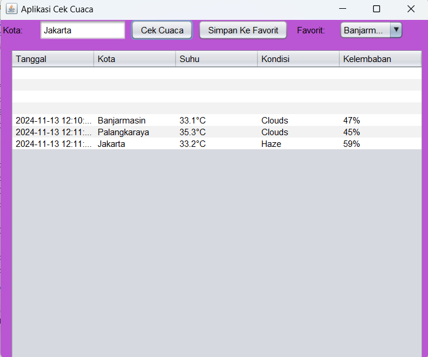

# Aplikasi CekCuacaSederhana
 Tugas6_NovitaFitriaRatnawati_2210010228
 
# Aplikasi Cek Cuaca Sederhana
Aplikasi Cek Cuaca Sederhana adalah aplikasi untuk mengecek cuaca secara real time menggunakan key api openweathermap

# Keunggulan Aplikasi
- Cek Cuaca Sederhana: Aplikasi ini terdapat tanggal, kota, suhu, kondisi dan kelembaban 

# Pembuat Aplikasi
 Novita Fitria Ratnawati - 2210010228 - Tugas 6

# Fitur
Aplikasi ini menawarkan fitur:

Cek cuaca sederhana

## Cara Menjalankan

1. Run File
2. Ketikkan Kota yang ingin diinput
3. Tekan Button Cek cuaca, maka akan keluar hasil
4. Tekan Button Simpan ke favorit, maka kota yang diinput akan tersimpan

# Demo
